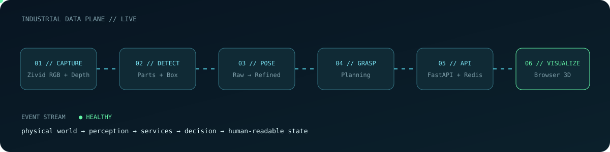
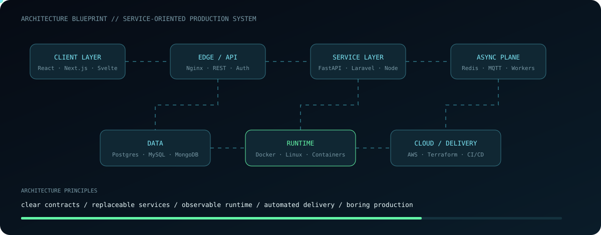
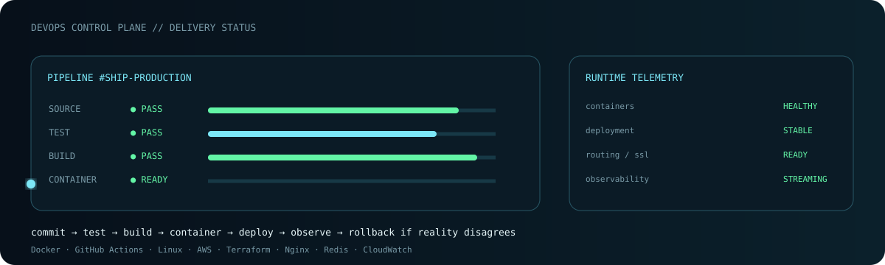
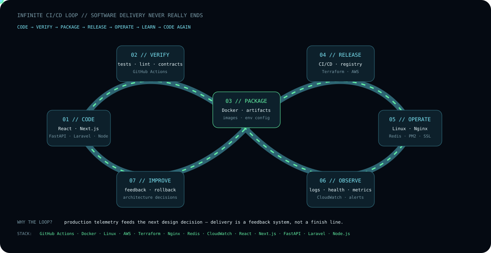
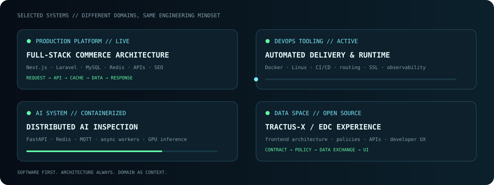
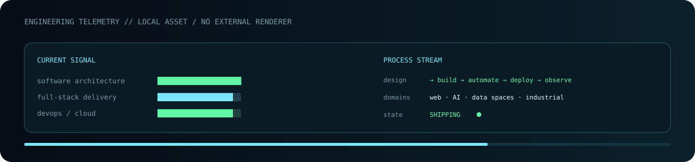

<div align="center">



<br/>

### I design software systems, build them across the stack, and make sure they survive production.

`SOFTWARE ENGINEERING` · `SYSTEM / SOFTWARE ARCHITECTURE` · `FULL-STACK` · `DEVOPS / CLOUD` · `AI SYSTEMS`

</div>

---

### `01 // SOFTWARE DELIVERY PLANE`



My work is not limited to one layer. I move between **architecture, frontend, backend, data, infrastructure and production operations** — choosing boundaries, defining contracts, building services, automating delivery and debugging the ugly parts when reality hits production.

---

### `02 // ARCHITECTURE BLUEPRINT`



I like systems with clear contracts and replaceable components: browser clients, APIs, asynchronous services, queues, databases, containers and cloud infrastructure. The domain can change; the engineering principles should survive it.

```text
CLIENTS        React · Next.js · Svelte
SERVICES       Python · FastAPI · Laravel · Node.js
CONTRACTS      REST · WebSockets · MQTT · gRPC
DATA           PostgreSQL · MySQL · MongoDB · Redis
RUNTIME        Docker · Linux · Nginx · PM2
DELIVERY       GitHub Actions · CI/CD · Terraform
CLOUD          AWS · Lambda · API Gateway · DynamoDB · CloudWatch
AI / DOMAIN    VLM · Computer Vision · GPU inference · Industrial software
```

---

### `03 // DEVOPS CONTROL PLANE`



For me DevOps is part of software engineering, not a hand-off after coding: **containerization, CI/CD, runtime topology, DNS/SSL, caching, observability, deployment and production troubleshooting** belong in the design conversation from the beginning.

---

### `04 // INFINITE CI/CD FEEDBACK LOOP`



CI/CD is not a one-way `commit → deploy` conveyor belt. I treat delivery as a **continuous engineering feedback loop**: code is verified and packaged, infrastructure releases it, production is observed, and telemetry feeds the next architecture and implementation decision.

`CODE` → `VERIFY` → `PACKAGE` → `RELEASE` → `OPERATE` → `OBSERVE` → `IMPROVE` → ∞

---

### `05 // SELECTED SYSTEMS`



#### `FULL-STACK PRODUCTION PLATFORM`
Commercial web architecture across Next.js, Laravel, MySQL, Redis, authentication, APIs, SEO, caching, deployment and production operations.

#### `DEVOPS / DELIVERY TOOLING`
Containerized runtimes and deployment workflows with Linux, Docker, CI/CD, routing, SSL, environment configuration and operational debugging.

#### `DISTRIBUTED AI INSPECTION`
An AI-enabled system built around service boundaries rather than a monolithic demo: FastAPI, Redis, MQTT, asynchronous workers, containers and GPU inference.

#### `DATA SPACE / OPEN-SOURCE WORK`
Frontend and developer-experience work around Tractus-X / EDC concepts, APIs, policy flows and data-exchange tooling.

---

### `06 // ENGINEERING TELEMETRY`



```python
class PayamMirzaei:
    primary = "Software Engineer"
    specialties = ["System Architecture", "Full-Stack", "DevOps / Cloud"]
    domains = ["Web Platforms", "AI Systems", "Data Spaces", "Industrial Software"]

    def ship(self, system):
        system.design()
        system.build()
        system.containerize()
        system.automate_delivery()
        system.observe_in_production()
        return "keep improving"
```

---

### `07 // SELECTED PUBLIC BUILDS`

- [`ForgeOPs`](https://github.com/payammirzaei/ForgeOPs) — deployment / DevOps tooling
- [`tractusx-edc-dashboard`](https://github.com/payammirzaei/tractusx-edc-dashboard) — data-space / Tractus-X UI work
- [`tractusx-policy-builder-ux-case-study`](https://github.com/payammirzaei/tractusx-policy-builder-ux-case-study) — policy-builder UX case study
- [`ai_quality_inspection`](https://github.com/payammirzaei/ai_quality_inspection) — AI-enabled inspection work
- [`SensorVerse`](https://github.com/payammirzaei/SensorVerse) — sensor / data engineering
- [`FineTune`](https://github.com/payammirzaei/FineTune) — AI experimentation

---

<div align="center">

```text
payam@production:~$ ./next_challenge.sh

[✓] software architecture with real constraints
[✓] full-stack products that have to scale
[✓] infrastructure that should be boring at 3 AM
[✓] AI that lives inside an actual system

STATUS: READY █
```

### BUILD SYSTEMS. SHIP PRODUCTS. OWN THE RUNTIME.

</div>
